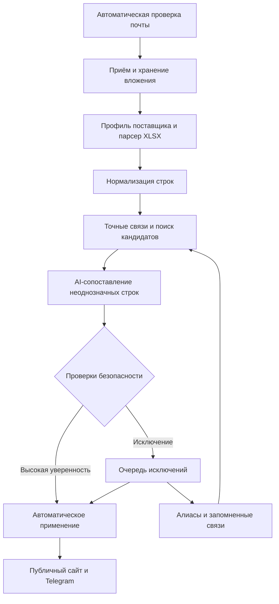

# Zabotik: web-сервис импорта прайс-листов поставщиков

## 1. Цель

Адаптировать существующий проект `loyalty-bot` / «Заботик» под автоматический web-сервис, который:

1. сам регулярно проверяет почту и забирает Excel-вложения поставщиков;
2. сам определяет поставщика и структуру файла;
3. сам разбирает, нормализует и сопоставляет позиции;
4. рассчитывает цену сайта как закупочную цену поставщика плюс настроенный процент;
5. добавляет новые позиции и обновляет существующие;
6. убирает с сайта позиции, которых больше нет в актуальной выборке поставщика;
7. отправляет человеку только исключения: неизвестный формат, низкую уверенность, конфликт атрибутов или подозрительное изменение прайса;
8. запоминает подтверждённые связи и сокращает очередь исключений в следующих импортах.

Ручная загрузка не является основным пользовательским сценарием и не входит в первый vertical slice. Она добавляется после работающих почты и AI как резервный канал для отладки, пересылок и редких файлов вне обычного потока.

Публичный магазин и Telegram Mini App — отдельные потребители канонического каталога. Новый импортный backoffice не должен смешиваться с публичным storefront API.

## 2. Что известно о текущем проекте

- Spring Boot 3.1.5, Java 21, package `com.plstk.loyaltybot`.
- PostgreSQL, Flyway-миграции; в старой конфигурации встречалось небезопасное сочетание отключённого Flyway и `ddl-auto: update`.
- React/Vite `admin-panel`.
- Multi-tenant модель по `shopId`.
- Уже проектировались или частично реализованы `ProductImportService`, `CommerceAdminController`, каталог, заказы и Telegram Mini App.
- Excel разбирался через Apache POI. В исходном файле были листы «Косметика и уход» и «Парфюмерия», заголовки в строке 6, около 2481 товарной позиции.
- Для commerce ранее были приняты: `BigDecimal`, идемпотентный импорт, `NEEDS_REVIEW`, транзакционная защита остатков. Старое решение «все новые товары скрыты до проверки» для этого продукта заменяется автоматической публикацией безопасно обработанных позиций.

Актуальный репозиторий в этом документе не исследован. Поэтому первый Cursor-этап — обязательный аудит: он должен подтвердить, какие из перечисленных компонентов действительно существуют сейчас.

## 3. Ключевое решение

### Это синхронизатор актуального ассортимента

Каждый успешно распознанный прайс-лист считается authoritative snapshot в пределах настроенного scope источника: например, весь каталог поставщика, только парфюмерия или конкретный склад.

- Строка есть в новом snapshot — предложение создаётся или обновляется и считается активным.
- Строки нет в новом snapshot — предложение этого поставщика деактивируется.
- У товара есть хотя бы одно активное предложение поставщика — он остаётся на сайте.
- Активных предложений больше нет — товар автоматически исчезает с сайта.
- Товар снова появился у любого поставщика — он автоматически возвращается на сайт.

«Удалить с сайта» означает убрать из storefront, а не физически удалить запись из PostgreSQL. Product, supplier link и order history сохраняются. Иначе повторное появление товара потребует заново обучать matching, а старые заказы потеряют ссылки.

Деактивация отсутствующих позиций запускается только после полностью успешного parse и batch-level проверок. Пустой, обрезанный или изменивший формат Excel должен попасть в quarantine, а не удалить весь ассортимент.

### Цена сайта

Для каждого активного supplier offer хранится закупочная цена и вычисленная цена сайта:

```text
sitePrice = round(supplierPrice * (1 + commissionPercent / 100))
```

Например, при цене поставщика 1000 ₽ и комиссии 30% цена сайта равна 1300 ₽. Процент берётся из настроек магазина с возможностью override для поставщика; способ округления задаётся pricing policy. При нескольких поставщиках одного товара рекомендуемый default — показывать минимальную рассчитанную цену среди активных предложений.

### Не использовать LLM как единственный matcher

Нейросеть не должна получать строку `Channel №5 100 ml` и самостоятельно придумывать товар. Это создаст тихие ошибки: неверный бренд, объём, концентрация, оттенок или вообще несуществующий SKU.

Правильный pipeline:

1. детерминированная нормализация;
2. точные связи по supplier SKU, штрихкоду и ранее подтверждённому соответствию;
3. поиск 3–10 кандидатов в собственном каталоге;
4. DeepSeek выбирает только одного из переданных кандидатов либо `NO_MATCH`;
5. приложение само валидирует JSON, ID кандидата и конфликтующие атрибуты;
6. неоднозначный результат отправляется пользователю на проверку;
7. подтверждённая связь сохраняется и в следующем импорте работает без AI.

Ложное сопоставление опаснее, чем `NEEDS_REVIEW`. Особенно нельзя склеивать разные объёмы, концентрации, оттенки, комплектации и тестеры.

## 4. Целевая архитектура



### Формат приложения

На MVP оставить модульный монолит:

- один Spring Boot backend;
- один PostgreSQL;
- существующий React/Vite admin panel;
- S3-совместимое хранилище для исходных файлов в production, MinIO локально;
- фоновые mailbox/import jobs внутри backend;
- DeepSeek за интерфейсом `AiCatalogMatcher`;
- IMAP/OAuth-коннектор за интерфейсом `MailboxClient`.

Не добавлять Kafka, RabbitMQ, Kubernetes и отдельный Python AI-worker. Для одного магазина и нескольких прайс-листов это увеличит стоимость разработки, но не улучшит результат. Если позже появятся десятки магазинов и большие очереди, worker можно вынести без изменения доменной модели.

### Web-поверхности

1. **Import backoffice** — JWT, доступ только владельцу/сотруднику магазина.
2. **Existing admin commerce** — каталог, заказы, изображения.
3. **Public storefront / Telegram Mini App** — товары, у которых есть активное supplier offer и нет ручного запрета показа; никаких закупочных цен, исходных строк или AI-решений.

## 5. Backend-модули

Не обязательно создавать Maven multi-module. Достаточно явных package boundaries:

```text
com.plstk.loyaltybot
  catalog/
  importing/
    api/
    application/
    domain/
    excel/
    mail/
    matching/
    persistence/
    storage/
  storefront/
  security/
```

Основные компоненты:

| Компонент | Ответственность |
| --- | --- |
| `AttachmentIngestionService` | принять файл, посчитать SHA-256, создать batch, обеспечить идемпотентность |
| `ImportFileStorage` | сохранить неизменённый исходный XLS/XLSX и выдать stream |
| `SupplierProfileService` | выбрать версию правил по supplier/source |
| `SpreadsheetParser` | безопасно прочитать workbook и вернуть сырые строки |
| `ImportRowNormalizer` | привести пробелы, регистр, Unicode, единицы, объём, числа и известные алиасы |
| `CandidateSearchService` | точный поиск и top-N кандидатов по PostgreSQL |
| `CatalogMatchOrchestrator` | объединить exact, fuzzy, AI и confidence gates |
| `AiCatalogMatcher` | provider-neutral интерфейс; реализация DeepSeek |
| `ImportExceptionService` | очередь только неоднозначных/подозрительных строк и файлов |
| `AliasLearningService` | сохранить подтверждённую supplier-связь или безопасный алиас |
| `ImportApplyService` | автоматическое или ручное транзакционное применение прошедших gates строк |
| `PricingService` | `supplierPrice + commissionPercent`, округление и выбор публичной цены |
| `CatalogAvailabilityService` | пересчитать видимость товара по активным предложениям всех поставщиков |
| `MailboxPollingJob` | найти новые письма и передать attachments в общий ingestion pipeline |

Все запросы и уникальные ограничения должны включать `shop_id`. Нельзя надеяться только на фильтр контроллера.

## 6. Модель данных

Существующая таблица `products` становится каноническим каталогом. Не надо создавать отдельный товар на каждый прайс-лист поставщика.

### Новые сущности

| Таблица | Назначение |
| --- | --- |
| `suppliers` | поставщик внутри магазина |
| `supplier_sources` | mailbox filters, snapshot scope, full-snapshot policy, commission override, auto-apply; позже manual fallback |
| `import_rule_versions` | immutable JSON-версия правил парсинга и преобразования |
| `import_files` | metadata + hash + storage key исходного вложения |
| `import_batches` | состояние запуска, статистика, ошибки, rule version |
| `import_rows` | raw JSON, normalized JSON, row number, status, выбранный product |
| `supplier_product_links` | запомненная связь supplier SKU/fingerprint → canonical `product_id` |
| `supplier_offers` | supplier price, commission percent used, calculated site price, stock, active, last_seen_batch_id |
| `catalog_aliases` | подтверждённые алиасы бренда/товара, scope и источник |
| `match_decisions` | audit: кандидаты, scores, model, prompt version, automatic/manual decision |
| `mailbox_connections` | безопасная конфигурация ящика, без открытых секретов |
| `mailbox_cursors` | UIDVALIDITY/UID либо provider cursor для идемпотентного чтения |

### Важные ограничения

- `unique(shop_id, sha256)` на импортируемый файл или более узкий ключ `shop_id + supplier_id + sha256`.
- `unique(shop_id, supplier_id, external_sku)` там, где SKU непустой.
- `supplier_product_links.product_id` может быть `NULL`, пока строка не сопоставлена.
- Денежные значения — `NUMERIC(19,2)` / `BigDecimal`.
- Raw row и normalized row хранить как `JSONB`, чтобы правила могли развиваться без миграции на каждый новый столбец поставщика.
- Каждая строка знает `source_sheet`, `source_row_number`, `import_batch_id`.
- Публичная цена товара и закупочная цена поставщика — разные поля; закупочная цена никогда не выдаётся storefront API.
- `last_seen_batch_id` используется для snapshot reconciliation; время само по себе недостаточно надёжно.
- Физический `Product` не удаляется из-за отсутствия в прайсе. Storefront visibility вычисляется по активным offers с учётом явного `manual_hidden` override.
- Новая валидная позиция автоматически появляется на сайте после успешного apply; сомнительная остаётся исключением.

## 7. State machine

### Import batch

```text
RECEIVED -> STORED -> PARSING -> NORMALIZING -> MATCHING
         -> VALIDATING -> AUTO_APPROVED -> APPLYING -> APPLIED
                      -> NEEDS_ATTENTION -> APPROVED -> APPLYING -> APPLIED
         -> QUARANTINED | FAILED
```

Повторная обработка должна быть явной операцией и создавать новый attempt, а не незаметно перезаписывать аудит старого запуска.

### Import row

```text
EXACT_MATCH
LEARNED_MATCH
AI_MATCH
AUTO_APPROVED
NEEDS_REVIEW
NEW_PRODUCT
IGNORED
INVALID
APPROVED
APPLIED
```

Основной путь — `EXACT_MATCH` / `LEARNED_MATCH` / безопасный `AI_MATCH` → `AUTO_APPROVED` → `APPLIED` без участия человека. `NEEDS_REVIEW` — исключение, а не обязательный этап каждого batch. Model confidence сам по себе не разрешает auto-apply: необходимы дополнительные детерминированные сигналы, отсутствие критичных конфликтов и прохождение batch-level sanity checks.

## 8. Правила поставщика

Правила хранятся версионно. Старый batch всегда ссылается на ту версию, по которой был разобран.

Для известного layout система автоматически использует опубликованную версию. При новом поставщике или schema drift DeepSeek получает названия листов, заголовки и небольшую выборку строк и предлагает строго типизированный mapping. Backend проверяет mapping по JSON Schema, запускает пробный parse и оценивает наличие обязательных полей, долю валидных строк и аномалии. Только прошедший validation mapping становится новой активной версией; сомнительный файл целиком попадает в `QUARANTINED`.

Web-редактор правил нужен как поздний инструмент разбора исключений, а не как обязательная настройка каждого ежедневного импорта.

Отдельно от column mapping источник хранит business policy:

```json
{
  "snapshotMode": "FULL",
  "snapshotScope": "SUPPLIER_ALL",
  "commissionPercent": 30.00,
  "publicPriceStrategy": "LOWEST_ACTIVE_OFFER",
  "roundingMode": "CURRENCY_MINOR_UNIT",
  "autoApply": true
}
```

Если один поставщик присылает отдельные файлы по категориям или складам, каждому source назначается собственный `snapshotScope`. Отсутствие товара деактивирует offer только внутри этого scope, иначе один частичный файл сможет ошибочно убрать позиции из другого.

Пример внутреннего JSON:

```json
{
  "sheetSelectors": ["Косметика и уход", "Парфюмерия"],
  "headerRow": 6,
  "firstDataRow": 7,
  "skipIf": [
    {"column": "name", "matches": "^(категория|итого|всего)$"}
  ],
  "columns": {
    "externalSku": ["Артикул", "Код"],
    "barcode": ["Штрихкод", "EAN"],
    "rawName": ["Наименование", "Товар"],
    "brand": ["Бренд", "Производитель"],
    "supplierPrice": ["Цена", "Опт"],
    "stock": ["Остаток", "Количество"]
  },
  "defaults": {
    "currency": "RUB"
  },
  "transformations": [
    {"field": "rawName", "operation": "collapseWhitespace"},
    {"field": "supplierPrice", "operation": "parseDecimal", "locale": "ru-RU"}
  ]
}
```

JSON проходит schema validation. Для AI-сгенерированной версии preview на 20–50 строках запускается автоматически. Ручное подтверждение требуется только при низкой полноте parse, пропаже обязательных колонок или schema drift за пределами допустимой политики источника.

## 9. Сопоставление названий

### 9.1 Детерминированная нормализация

- Unicode NFKC;
- `trim`, collapse whitespace, lowercase для поискового ключа;
- `ё`/`е` как дополнительный поисковый вариант, не как потеря оригинала;
- нормализация кавычек, дефисов и знаков объёма;
- `100мл`, `100 ml`, `100 ML` → структурный атрибут `{value: 100, unit: "ml"}`;
- транслитерация используется для поиска кандидатов, но оригинальное значение сохраняется;
- brand aliases применяются только в соответствующем поле/контексте;
- стоп-слова поставщика (`тестер`, `распродажа`, внутренние метки) извлекаются в атрибуты, а не просто удаляются.

`Channel` нельзя глобально заменять на `Chanel`: это допустимый match только в косметическом контексте и при наличии кандидата Chanel.

### 9.2 Точные сигналы

Порядок:

1. supplier ID/SKU + сохранённая связь;
2. EAN/barcode;
3. ранее подтверждённый full-name fingerprint;
4. точное совпадение нормализованных brand + line + variant + size;
5. только затем fuzzy/AI.

### 9.3 Поиск кандидатов

На PostgreSQL включить `pg_trgm` и искать top-N по комбинации:

- similarity нормализованного имени;
- brand alias;
- совпадение категории;
- совпадение объёма/единицы;
- совпадение концентрации, пола, оттенка, комплектации;
- штраф за конфликт атрибутов.

Нейросети передаётся не весь каталог, а исходная строка и максимум 10 кандидатов с реальными ID.

### 9.4 Confidence gates

Model confidence нельзя считать доказательством. Итоговый score рассчитывает приложение.

- `AUTO`: exact SKU/link/barcode либо AI выбрал реального кандидата, deterministic score выше настроенного порога, обязательные атрибуты совпали и конфликтов нет;
- `REVIEW`: AI выбрал допустимого кандидата, но итоговый score ниже auto-apply threshold или данных недостаточно;
- `NO_MATCH`: кандидата нет либо конфликтуют критичные атрибуты;
- при различии объёма, оттенка, концентрации или комплектации auto-match запрещён.

Порог задаётся отдельно для каждого источника. Первые импорты нового поставщика можно прогнать в shadow mode: система строит решения и diff, но не применяет их. После проверки метрик source переводится в `autoApply=true`. Это разовая настройка источника, а не ручная обработка каждого файла.

## 10. DeepSeek integration

На 30 августа 2026 DeepSeek предоставляет OpenAI-compatible API, JSON Output и function/tool calls. Модель и endpoint должны задаваться конфигурацией, а не быть зашиты в код. Для массового дешёвого matching логично начинать с flash-модели; pro использовать только как опциональный второй проход.

AI используется в двух местах:

1. `AiSpreadsheetLayoutDetector` — определяет колонки и структуру неизвестного workbook;
2. `AiCatalogMatcher` — выбирает товар только из найденных backend-кандидатов.

Интерфейсы:

```java
public interface AiCatalogMatcher {
    AiMatchResponse match(AiMatchRequest request);
}

public interface AiSpreadsheetLayoutDetector {
    LayoutDetectionResponse detect(LayoutDetectionRequest request);
}
```

Требования к реализации:

- timeout, retry только на retryable ошибки, exponential backoff;
- rate limit и circuit breaker;
- JSON/schema validation;
- ответ может выбрать только ID из `candidateIds` либо `NO_MATCH`;
- сохранять provider, model, prompt version, latency и token usage;
- не логировать API key и полные email-сообщения;
- не отправлять в AI имя/адрес покупателя, email body и другие персональные данные;
- fallback: строка `NEEDS_REVIEW` либо batch `QUARANTINED`, а не падение всего pipeline;
- ключ только через environment/secret store.

### Production system prompt для matcher

```text
You are a conservative catalog entity matcher for cosmetics and perfumery.
Return JSON only. You may select only one candidate_id from the supplied
candidate list, or NO_MATCH. Never invent product IDs, brands, volumes,
concentrations, shades, SKUs, or barcodes.

A match is invalid when critical attributes conflict, including volume,
unit, concentration, shade, set composition, tester/retail packaging,
or product line. A spelling/transliteration difference alone is not a
conflict. False positives are more harmful than NO_MATCH.

Output schema:
{
  "row_id": "string",
  "decision": "MATCH" | "NO_MATCH",
  "candidate_id": "string or null",
  "confidence": 0.0,
  "matched_attributes": ["string"],
  "conflicts": ["string"],
  "reason": "short string"
}
```

В user payload передавать компактный JSON: `row_id`, raw/normalized fields и массив candidates. После ответа обязательно повторно проверять membership ID и критические атрибуты на backend.

## 11. Почта

### Основной MVP-вход

- backend подключается по IMAP через OAuth2 либо app password;
- доступ по возможности read-only;
- polling раз в 5 минут, а не сложный IMAP IDLE;
- фильтры source: папка, allowlist отправителей, regex темы, regex имени файла;
- принимать только `.xlsx` и при необходимости `.xls`; `.xlsm` на MVP отклонять;
- не помечать письмо прочитанным и не удалять его;
- идемпотентность по `mailbox + UIDVALIDITY + UID + attachment index/hash`;
- после скачивания attachment немедленно запускается общий import pipeline;
- несколько писем и вложений обрабатываются независимо и параллельно в пределах configured concurrency;
- mailbox/source распознаётся по sender/domain/subject/filename, а неизвестный источник классифицируется AI и при сомнении помещается в quarantine;
- ручная загрузка подключается позже к тому же `AttachmentIngestionService` и не влияет на архитектуру основного потока.

Секреты шифруются at rest. Master key хранится вне БД. В UI секрет после сохранения никогда не возвращается целиком.

### Безопасность файлов

- лимит размера workbook;
- лимит строк, листов, длины ячейки и распакованного ZIP/XML;
- защита от zip bomb встроенными лимитами Apache POI;
- формулы не исполнять, использовать cached value либо помечать строку invalid;
- макросы не исполнять;
- исходник неизменяемый, обработка только через stream;
- ошибки одной строки не должны валить весь batch.

## 12. Web UI

Добавить в существующий `admin-panel` раздел «Импорт поставщиков».

### Страницы

1. `/shops/:shopId/imports` — automation dashboard: обработано автоматически, исключения, quarantined, ошибки.
2. `/shops/:shopId/imports/exceptions` — общая очередь исключений из всех писем.
3. `/shops/:shopId/imports/:batchId` — строки, raw/normalized, match, confidence, diff и audit.
4. `/shops/:shopId/suppliers` — поставщики, mailbox sources, shadow/auto-apply policy и thresholds.
5. `/shops/:shopId/suppliers/:supplierId/rules` — поздний mapping/rules editor и автоматический preview.
6. `/shops/:shopId/mailboxes` — подключение, test connection, last poll и health.
7. `/shops/:shopId/catalog/aliases` — learned links/aliases с возможностью отмены.
8. `/shops/:shopId/imports/manual` — резервная ручная загрузка, добавляется после почтового pipeline и AI.

### UX очереди исключений

- главная метрика — доля строк и файлов, обработанных без участия человека;
- по умолчанию показывать только `NEEDS_REVIEW`, `QUARANTINED`, `INVALID` и suspicious batch alerts;
- клавиатурные действия approve / no match / create new;
- side-by-side исходная строка и карточка кандидата;
- явно показывать расхождения volume/shade/concentration;
- массовое подтверждение только для одинакового reason и без критических конфликтов;
- безопасный batch применяется автоматически при `source.autoApply=true`;
- для exception batch показывать summary create/update/unchanged/invalid перед ручным Resume/Apply;
- безопасно созданные товары автоматически показываются после apply, если у них есть активное offer; оператор может задать `manual_hidden`, который синхронизация не снимает.

## 13. API outline

Все endpoints shop-scoped и используют существующий `ShopAccessService`/эквивалент.

```text
GET    /api/shops/{shopId}/imports
GET    /api/shops/{shopId}/imports/{batchId}
GET    /api/shops/{shopId}/imports/{batchId}/rows
POST   /api/shops/{shopId}/imports/{batchId}/retry
POST   /api/shops/{shopId}/imports/{batchId}/approve
POST   /api/shops/{shopId}/imports/{batchId}/apply
PATCH  /api/shops/{shopId}/imports/{batchId}/rows/{rowId}/decision

GET    /api/shops/{shopId}/suppliers
POST   /api/shops/{shopId}/suppliers
POST   /api/shops/{shopId}/suppliers/{supplierId}/rule-versions
POST   /api/shops/{shopId}/suppliers/{supplierId}/rules/preview

GET    /api/shops/{shopId}/mailboxes
POST   /api/shops/{shopId}/mailboxes
POST   /api/shops/{shopId}/mailboxes/{mailboxId}/test
POST   /api/shops/{shopId}/mailboxes/{mailboxId}/poll

# Добавляется позднее как fallback:
POST   /api/shops/{shopId}/imports/manual-upload
```

Долгие операции возвращают `202 Accepted + batchId`. UI получает прогресс polling-ом раз в 2–3 секунды. WebSocket/SSE на MVP не нужен.

## 14. Применение импорта

`Apply` — отдельный технический этап после parsing/matching/validation, но при нормальном ходе запускается автоматически.

1. Повторно проверить, что batch не был применён.
2. Проверить batch-level guards: обязательные колонки, долю valid rows, резкое падение числа строк, аномальные price/stock deltas и schema drift.
3. Проверить row-level auto-approval gates и отсутствие blocking exceptions.
4. Зафиксировать rule version, AI prompt/model versions и decisions.
5. Для каждой строки создать/обновить `supplier_offer`, записать `supplierPrice`, применённый `commissionPercent`, рассчитанный `sitePrice`, stock и `lastSeenBatchId`.
6. Создать безопасно распознанные `NEW_PRODUCT`; сомнительные оставить исключением.
7. Для `FULL` snapshot после успешной обработки деактивировать offers в том же supplier/source scope, у которых `lastSeenBatchId != currentBatchId`.
8. Пересчитать каталог: если есть активные offers, товар показывается и получает публичную цену по стратегии источника/магазина; если offers нет, товар исчезает со storefront. `manual_hidden=true` всегда имеет приоритет.
9. Для нескольких активных offers одного товара default-стратегия выбирает минимальный рассчитанный `sitePrice`; закупочные цены остаются внутренними.
10. Для delta-файла отсутствие строки ничего не означает. Для partial snapshot reconciliation ограничивается настроенным scope.
11. Записать audit и итоговые counters: added, updated, priceChanged, removedFromStorefront, reactivated, unchanged.
12. Повторный Apply возвращает прежний результат и ничего не дублирует.

## 15. Наблюдаемость и тесты

Главный продуктовый показатель — **automation rate**: доля файлов и строк, обработанных от входящего письма до обновления каталога без участия человека.

Метрики:

- batches по статусам, включая `QUARANTINED`;
- rows exact/learned/AI-auto/review/invalid;
- automation rate и exception rate по каждому поставщику;
- mailbox poll lag/errors и число непрочитанных системой вложений;
- schema drift и batch anomaly counters;
- added/updated/priceChanged/removed/reactivated products;
- calculated price и commission policy errors;
- apply duration;
- AI latency/errors/tokens/cost estimate;
- duplicate attachment count.

Обязательные fixtures:

- реальные обезличенные письма с supplier XLSX attachments;
- два письма и несколько вложений в одном письме;
- два разных layout одного поставщика и внезапный schema drift;
- `Chanel`, `Шанель`, `Channel`;
- одинаковое имя с 50/100 ml;
- tester против retail;
- набор против одиночного товара;
- пустой SKU, дубли, formula cell, смешанные числовые форматы;
- повторное получение того же письма/вложения;
- резкое падение числа строк и аномальный price delta.
- товар, исчезнувший и затем вернувшийся в следующем full snapshot;
- один товар у двух поставщиков, исчезновение только у одного;
- partial category scope, который не должен затрагивать другие категории;
- supplier price 1000 и commission 30% → site price 1300 с заданным округлением.

Минимальные тесты:

- mailbox integration через test server или fake adapter;
- unit для rule schema, layout validation и normalizer;
- parser contract tests на fixtures;
- PostgreSQL/Testcontainers для trigram, tenant isolation и scheduler claims;
- DeepSeek provider tests через mock HTTP server;
- automatic apply idempotency/concurrency tests;
- snapshot reconciliation, multi-supplier availability и pricing tests;
- frontend test exception-only flow;
- E2E: email → attachment → AI layout → parse → match → safety gates → auto-apply;
- E2E: следующий snapshot без товара → товар исчезает с сайта; повторное появление → возвращается;
- E2E exception: suspicious email/file → quarantine → ручное решение → resume.

## 16. Последовательность реализации

### Этап 0. Repo audit

Подтвердить реальное состояние проекта и скорректировать названия файлов/классов.

### Этап 1. Automation foundation

Entities, state machines, immutable file storage, ingestion service и DB job claims. Без ручной загрузки.

### Этап 2. Email-first ingestion

IMAP/OAuth, encrypted secrets, source filters, mailbox cursor, attachment deduplication. Результат этапа: письмо автоматически превращается в сохранённый batch.

### Этап 3. AI layout detection и parser

DeepSeek определяет структуру неизвестного Excel; backend валидирует rule и безопасно парсит строки.

### Этап 4. Normalization и candidate search

SKU/barcode/learned links, pg_trgm, critical-attribute extraction/conflicts.

### Этап 5. AI matching и automation gates

DeepSeek выбирает только переданный candidate; backend рассчитывает итоговый score и автоматически пропускает безопасные строки.

### Этап 6. Automatic apply и learning loop

Batch sanity checks, комиссия и публичная цена, full-snapshot reconciliation, автоматическое появление/исчезновение товаров, aliases/links.

### Этап 7. Operations UI

Dashboard автоматики и единая очередь исключений, а не обязательный ручной review каждого файла.

### Этап 8. Manual upload fallback

Только теперь добавить резервную загрузку, повторно используя готовый ingestion pipeline.

### Этап 9. Hardening и production

Flyway, storage, security limits, recovery, metrics, backup, E2E.

## 17. Общий prompt для каждого чата Cursor

В начало каждого нового Cursor-чата вставлять этот блок, затем конкретную задачу этапа.

```text
Ты работаешь в существующем репозитории loyalty-bot / Zabotik.
Это Spring Boot + Java + PostgreSQL + React/Vite приложение, но фактический
код репозитория является единственным источником истины.

Цель продукта: полностью автоматический email-first pipeline. Прайс-листы
приходят на почту в большом количестве, система сама получает вложения,
распознаёт layout, сопоставляет позиции и применяет безопасные изменения.
Человек работает только с исключениями. Manual upload — поздний fallback,
его нельзя делать основным MVP-сценарием или реализовывать раньше Prompt 8.

Перед изменениями:
1. Прочитай AGENTS.md, README, pom/build files, application configs,
   docker compose, последние Flyway migrations и релевантные backend/frontend
   пакеты.
2. Если существуют docs/PROJECT_PLAN.md, docs/STATE.md и docs/DECISIONS.md,
   прочитай их. Не перезаписывай решения без объяснения.
3. Найди существующие аналоги controllers/services/entities/components и
   следуй conventions репозитория. Не выдумывай пути и классы из prompt,
   если реальный проект устроен иначе.
4. Сначала дай короткий audit и перечень файлов, которые собираешься менять.
   Затем реализуй только текущую задачу.

Общие ограничения:
- сохраняй multi-tenant isolation по shopId во всех queries и constraints;
- используй BigDecimal/NUMERIC для денег;
- валидные новые товары автоматически появляются на storefront после apply;
- товар без активных supplier offers автоматически исчезает со storefront, но не удаляется физически;
- public price рассчитывается из supplier price и versioned commission policy;
- импорт и mailbox polling идемпотентны, source file и audit immutable;
- основной путь не должен требовать нажатия Review/Apply;
- model confidence не является единственным auto-apply сигналом;
- critical attribute conflicts всегда блокируют auto-match;
- не смешивай admin DTO/API с public storefront DTO/API;
- секреты только encrypted/env/secret storage, не логируй их;
- не добавляй Kafka/RabbitMQ/microservices без доказанной необходимости;
- не ослабляй существующую авторизацию;
- Flyway migration version выбери после проверки последней реальной версии;
- не рефактори несвязанный код.

После реализации:
1. Запусти релевантные backend и frontend tests/build/lint.
2. Исправь ошибки, вызванные изменениями.
3. Покажи изменённые файлы, команды проверки, результат и оставшиеся риски.
4. Обнови docs/STATE.md и docs/DECISIONS.md; не отмечай непроверенное как done.
5. Остановись. Не начинай следующий этап.
```

## 18. Пошаговые prompts для Cursor

### Prompt 0 — аудит проекта

```text
Выполни только audit для автоматического email-first импорта supplier Excel.
Код пока не изменяй.

Найди и опиши:
- фактические версии Java/Spring/React/Node;
- auth и shop access;
- Product/commerce model: canonical product, supplier identity/price, public
  price и stock;
- текущие правила visible/active/delete и влияние удаления на order history;
- несколько supplier offers на один product и текущую стратегию выбора цены;
- существующие ProductImportService, POI rules, endpoints и UI;
- последнюю Flyway version и ddl-auto settings;
- catalog/order/image/storefront readiness;
- scheduler/job locking, mail, encryption и storage patterns;
- test/Docker infrastructure;
- незакоммиченные участки, которые нельзя затереть.

Создай/обнови docs/SUPPLIER_IMPORT_AUDIT.md. Добавь mapping-таблицу reuse /
extend / replace / missing и отдельно опиши кратчайший email-to-stored-batch
vertical slice. Никаких production code changes.
```

### Prompt 1 — automation foundation

```text
На основе audit реализуй foundation, но не manual upload.

Зафиксируй ADR: modular monolith, email-first automation, existing products as
canonical catalog, supplier offers/links separated, AI provider-neutral,
manual upload only after complete email+AI pipeline.

Добавь Flyway/JPA domain для Supplier, SupplierSource, MailboxConnection,
MailboxCursor, ImportRuleVersion, ImportFile, ImportBatch, ImportRow,
SupplierProductLink, SupplierOffer, MatchDecision. Добавь shop-scoped indexes,
FK/unique constraints, JSONB raw/normalized data и NUMERIC(19,2).

SupplierSource должен поддерживать snapshotMode FULL/DELTA, snapshotScope,
commissionPercent override, publicPriceStrategy, rounding policy, shadowMode
и autoApply. SupplierOffer хранит supplierPrice, appliedCommissionPercent,
calculatedSitePrice, active и lastSeenBatchId.

Создай ImportFileStorage и AttachmentIngestionService, принимающий stream +
source metadata, считающий SHA-256, сохраняющий immutable file и идемпотентно
создающий STORED batch. Не создавай HTTP upload endpoint.

Добавь DB-backed claim/lease abstraction для resumable background jobs и tests
на tenant isolation, unique constraints, duplicate attachment и expired claim.
```

### Prompt 2 — email-first ingestion

```text
Реализуй первый настоящий vertical slice: mailbox -> attachment -> STORED batch.

Создай MailboxClient interface и IMAP implementation. Поддержи OAuth2 или app
password по первому фактическому провайдеру. Secret шифруй AES-GCM/envelope с
master key из env либо используй существующий encryption service; никогда не
возвращай и не логируй plaintext.

SupplierSource: folder, sender/domain allowlist, subject/filename regex,
snapshotMode/scope, commission percent, price strategy, enabled. Polling каждые 5 минут configurable. Не mark read,
delete или move письмо. Cursor: mailbox + UIDVALIDITY + UID + attachment
index/hash. Каждое допустимое xlsx/xls attachment передай в
AttachmentIngestionService.

Добавь scheduler locking/claims для нескольких replicas, test connection и
manual poll endpoints, mailbox/source minimal UI с health/last poll. Tests:
duplicate poll, multiple emails/attachments, reconnect/UIDVALIDITY, wrong
sender, unsupported type, oversize, secret redaction. Не добавляй parser,
DeepSeek или manual file upload.
```

### Prompt 3 — AI layout detection и безопасный parser

```text
Реализуй автоматический переход STORED -> PARSING без ручной настройки файла.

Добавь provider-neutral AiSpreadsheetLayoutDetector и DeepSeek implementation.
baseUrl/apiKey/model/timeouts из config/env. Модель получает только workbook
metadata, headers и ограниченную выборку строк, возвращает strict JSON rule:
sheets, header/data rows, typed column mapping, skip rules, defaults. Никакого
произвольного SpEL/JavaScript/SQL.

Backend валидирует rule JSON Schema, обязательные fields, уникальность mapping
и запускает automatic preview на 20-50 строках. Известный layout переиспользует
published rule без AI. Новый валидный layout создаёт immutable rule version;
сомнительный/schema-drift batch -> QUARANTINED.

Apache POI parser: safe ZIP/XML limits, no formula execution, limits на sheets,
rows/cell length, per-row INVALID без падения batch, source sheet/row + raw
JSON, repeat-safe persistence. Добавь fixtures для листов «Косметика и уход» /
«Парфюмерия» с header row 6 и изменённого layout. Mock DeepSeek tests: valid,
invented column, malformed/empty JSON, timeout, 429/5xx. UI rules editor пока
не добавляй.

Для FULL snapshot supplier price и устойчивый identifier/name обязательны.
Если ценовая колонка пропала или доля валидных цен резко упала, quarantine весь
batch: такой файл не имеет права запускать ассортиментный reconciliation.
```

### Prompt 4 — normalization и deterministic candidates

```text
Реализуй автоматический PARSING -> NORMALIZING -> candidate search без ручного
экрана.

Извлекай brand, line/name, variant, volume+unit, concentration, shade,
tester/set markers, SKU, barcode, supplierPrice, stock. Сохраняй original и
normalized JSON. Порядок: SupplierProductLink, exact barcode, safe fingerprint,
затем PostgreSQL pg_trgm top-10 candidates с explainable score breakdown.

Critical conflicts volume/unit, concentration, shade, set composition,
tester/retail запрещают auto-match. Channel нельзя глобально заменять на Chanel;
это только scoped search signal. Добавь tests Chanel/Шанель/Channel, 50/100 ml,
tester/set, duplicate barcode и cross-shop isolation. DeepSeek matcher пока не
добавляй.
```

### Prompt 5 — DeepSeek matcher и automation gates

```text
Добавь AiCatalogMatcher и автоматические row-level decision gates.

DeepSeek получает row и максимум 10 реальных candidates. Strict JSON может
выбрать только candidateId из списка либо NO_MATCH. Backend проверяет schema,
candidate membership, required attributes и critical conflicts. Итоговый score
рассчитывает приложение из deterministic signals + AI result; model confidence
не может быть единственным основанием.

EXACT/LEARNED и сильный AI_MATCH без conflicts -> AUTO_APPROVED. Слабый match,
NO_MATCH, invalid response или timeout -> NEEDS_REVIEW, но batch продолжает
обрабатываться. Thresholds versioned per SupplierSource; поддержи shadowMode и
autoApply flags.

Валидная строка без существующего catalog candidate может стать NEW_PRODUCT:
AI нормализует только разрешённые поля, backend валидирует обязательные данные.
Полностью описанная безопасная NEW_PRODUCT допускается к AUTO_APPROVED;
неполная или противоречивая остаётся исключением.

Добавь retry/backoff только для retryable status, rate limit, circuit breaker,
tokens/latency/promptVersion audit и redacted logs. Tests: invented ID,
malformed JSON, conflict, boundary thresholds, disabled provider, shadow mode.
```

### Prompt 6 — automatic apply и learning loop

```text
Реализуй end-to-end автоматическую синхронизацию ассортимента без обязательной
кнопки пользователя.

Перед apply выполни batch-level guards: required columns, valid-row ratio,
row-count collapse, schema drift, duplicate explosion, price/stock deltas.
Если source.autoApply=true, нет blocking exceptions и guards пройдены, batch
автоматически APPLYING -> APPLIED. Иначе NEEDS_ATTENTION/QUARANTINED.

Для каждой актуальной строки upsert SupplierOffer: supplierPrice,
appliedCommissionPercent, calculatedSitePrice = moneyRound(supplierPrice *
(1 + commissionPercent/100)), stock, active=true, lastSeenBatchId=current.
Используй BigDecimal и versioned pricing/rounding policy.

После полностью успешного FULL snapshot деактивируй offers в том же supplier +
snapshotScope, которые не были seen в current batch. DELTA ничего не
деактивирует. Никогда не reconcile вне scope текущего файла.

Пересчитай storefront projection:
- один или больше active offers и manualHidden=false -> product виден;
- ноль active offers -> product не возвращается storefront API;
- product физически не удаляется, order history и links сохраняются;
- reappeared offer автоматически возвращает product на сайт;
- при нескольких offers default public price = минимальный calculatedSitePrice.

Безопасные NEW_PRODUCT создаются и появляются автоматически. manualHidden —
явный override оператора, который sync не снимает.

Сохраняй SupplierProductLink после безопасного automatic/manual решения.
CatalogAlias только с ограниченным scope. Добавь double/concurrent apply,
rollback, FULL-vs-DELTA, scope isolation, commission+rounding, price change,
disappearance/reactivation и multi-supplier availability tests. Anomalous
row-count/price drop обязан quarantine batch до любых деактиваций. Реализуй
automatic resume/recovery после рестарта.
```

### Prompt 7 — operations dashboard и исключения

```text
Реализуй web UI как панель контроля автоматики, а не ручной импортёр.

Dashboard: automation rate, processed emails/files/rows, mailbox health,
added/updated/priceChanged/removed/reactivated товары, running/failed/quarantined
batches и supplier exception rates. Главный экран
не должен требовать открытия каждого успешного batch.

Единая exception queue: NEEDS_REVIEW, INVALID, QUARANTINED, suspicious price/
row-count/schema changes. Detail показывает raw/normalized row, candidates,
score, conflicts, AI/model/prompt audit и batch diff. Actions: MATCH,
NO_MATCH, CREATE_PRODUCT, IGNORE, SET_MANUAL_HIDDEN, approve layout, resume batch. Optimistic lock,
audit reviewer/time/previous decision; bulk action только для совместимых rows.

Добавь shop-scoped APIs, pagination/filtering и frontend tests. Успешный
auto-applied batch доступен только как audit/report. Manual upload не добавляй.
```

### Prompt 8 — manual upload fallback

```text
Только теперь добавь резервную manual upload функцию. Она не должна создавать
отдельную логику импорта.

POST shop-scoped multipart endpoint валидирует type/signature/size и передаёт
stream в тот же AttachmentIngestionService, что mailbox. После этого работают
те же AI layout, parser, matcher, gates и automatic apply policies. В UI помести
upload в secondary action «Загрузить файл вручную», не на главный dashboard.

Добавь tests на duplicate email-vs-manual attachment, wrong tenant/type/size и
повторный request. Не меняй основной email-first UX.
```

### Prompt 9 — production hardening

```text
Проведи hardening без новых features.

Проверь Flyway production + ddl-auto validate/none; disabled AI/mailbox startup;
tenant/auth isolation; IMAP reconnect; scheduler single-claim; interrupted job
recovery; ZIP/XML/file limits; storage access/retention; secret redaction;
prompt injection through cell content; DB indexes/query plans; bounded AI/job
concurrency; metrics/alerts; backups; admin/public API separation.

Добавь E2E happy path:
email -> attachment -> AI layout -> parse -> match -> gates -> automatic apply
-> commission applied -> new product appears on storefront.
Добавь второй E2E: следующий FULL snapshot не содержит product -> его offer
deactivated и product исчезает со storefront; если другой supplier offer active,
product остаётся; при повторном появлении product возвращается автоматически.
И E2E exception path: schema drift/anomaly -> quarantine -> operator decision ->
resume. Обнови deployment docs и sample env без секретов.
```

### Prompt 10 — финальная ревизия

```text
Не добавляй features. Проведи senior Java/React review supplier automation.

Ищи silent corruption, пропущенные письма, duplicate processing, cross-tenant
access, non-idempotent transitions, scheduler races, locale/money bugs, N+1,
unbounded files/queries, prompt injection, invented AI IDs, false auto-apply,
secret leakage и public/admin DTO leaks.

Сначала findings по severity с точными файлами. Исправь Critical/High и
безопасные Medium в scope. Запусти полный backend/frontend/E2E suite. Создай
docs/SUPPLIER_IMPORT_RELEASE_CHECKLIST.md, включив измерение automation rate и
shadow-mode acceptance перед включением autoApply для нового поставщика.
```

## 19. Критерии готовности MVP

- Реальное письмо с XLSX автоматически обнаруживается и обрабатывается без открытия web-интерфейса.
- Успешный batch проходит от почты до обновления `supplier_offers` без кнопок Review/Apply.
- Повторный poll или повторно полученное вложение не дублируют данные.
- Неизвестный layout автоматически превращается в валидированную versioned rule либо безопасно отправляется в quarantine.
- 50 ml никогда автоматически не сопоставляется с 100 ml.
- DeepSeek не может выбрать несуществующий ID.
- Ошибка DeepSeek не теряет письмо и не блокирует обработку других файлов.
- Пользователь видит только исключения и понятную причину остановки.
- Подтверждённая supplier-связь используется в следующем batch без AI.
- Automatic Apply повторяем и идемпотентен.
- Валидный новый товар автоматически появляется на сайте.
- Цена 1000 ₽ при комиссии 30% становится 1300 ₽ согласно настроенной rounding policy.
- Товар, отсутствующий в следующем успешном FULL snapshot, исчезает со storefront.
- Если тот же товар остаётся у другого поставщика, он не исчезает; публичная цена пересчитывается по оставшимся offers.
- При повторном появлении offer товар автоматически возвращается на сайт без нового matching.
- Пустой, обрезанный или сломанный файл не может массово убрать товары с сайта.
- Данные одного `shopId` недоступны другому.
- Supplier price и исходные строки не попадают в storefront API.
- Почтовые и AI-секреты отсутствуют в БД в открытом виде, логах и frontend responses.
- Manual upload не нужен для нормальной работы и реализован только как поздний fallback.

## 20. Что нужно для точной адаптации

Перед запуском Prompt 0 Cursor должен получить актуальный репозиторий. Особенно важно подтвердить:

- существует ли уже `ProductImportService` и что он реально делает;
- какие migrations были применены после старых планов;
- закончены ли CatalogPage и image pipeline;
- используется ли текущий `products` как каталог или как supplier row;
- какой почтовый провайдер будет подключён первым;
- где и как сейчас развёрнут backend и PostgreSQL.

После audit названия классов, migrations и endpoints в последующих prompts следует один раз синхронизировать с реальным кодом.

## 21. Актуальные ссылки DeepSeek

- [Your First API Call](https://api-docs.deepseek.com/)
- [JSON Output](https://api-docs.deepseek.com/guides/json_mode/)
- [Tool Calls / schema](https://api-docs.deepseek.com/guides/tool_calls/)
- [Chat Completions API](https://api-docs.deepseek.com/api/create-chat-completion/)

## 22. Production deployment: env vars, метрики, backup (Prompt 09)

Написано во время hardening (см. ADR-009 в `docs/DECISIONS.md`). Ничего здесь не описывает новую
функциональность — только то, как безопасно эксплуатировать то, что уже построено в Prompt 01-08.

### Disabled-by-default AI/mailbox providers

Приложение обязано стартовать и проходить `mvn test`/`npm run build` даже без единой настоящей
credential — это уже реализовано в Prompt 02/03/05 (`SupplierImportAiConfig` выбирает
`Disabled*`-заглушки, когда `SUPPLIER_IMPORT_DEEPSEEK_API_KEY` не задан; `MailboxPollingJob` просто
находит ноль `enabled=true` mailboxes и no-op'ает). Prompt 09 не меняет этот выбор — только
подтверждает его тестами (`SupplierImportEndToEndTest`) и документирует явно здесь, чтобы не
переизобретался в будущем prompt.

### Env vars reference (production)

Ничего секретного ниже — только имена переменных и **не-секретные** defaults, взятые из
`application.yml`/`application-prod.yml`. Реальные значения секретов никогда не коммитятся (см.
`.gitignore`: `*.env`).

| Переменная | Назначение | Default | Обязательна в prod |
| --- | --- | --- | --- |
| `DATABASE_URL`/`DATABASE_USERNAME`/`DATABASE_PASSWORD` | PostgreSQL | `jdbc:postgresql://localhost:5432/loyalty_db`/`postgres`/(пусто) | да |
| `JWT_SECRET` | JWT signing | — | да |
| `ENCRYPTION_KEY` | AES-256-GCM для `TokenEncryptionService` (mailbox secrets, admin webhooks) | — | да |
| `ADMIN_SECRET_CODE` | bootstrap admin auth | — | да |
| `SCHEDULING_POOL_SIZE` | размер общего `@Scheduled` thread pool (все supplier-import jobs + loyalty cron) | `10` | нет |
| `SUPPLIER_IMPORT_STORAGE_PATH` | база immutable file storage (`LocalImportFileStorage`) | `./data/import-files` (dev) | да, если mailbox/manual upload включены — должен указывать на persisted volume |
| `SUPPLIER_IMPORT_MAX_FILE_SIZE_BYTES` | лимит размера вложения/upload | `31457280` (30 MiB) | нет |
| `SUPPLIER_IMPORT_DEEPSEEK_API_KEY` | DeepSeek layout+matcher | (пусто → disabled providers) | нет, но нужен для AI-стадий |
| `SUPPLIER_IMPORT_DEEPSEEK_MODEL`/`_BASE_URL`/`_TIMEOUT_MS`/`_MAX_RETRIES`/`_RETRY_BACKOFF_MS` | DeepSeek HTTP client tuning | `deepseek-chat`/`https://api.deepseek.com`/`20000`/`2`/`500` | нет |
| `SUPPLIER_IMPORT_PARSER_MAX_SHEETS`/`_MAX_ROWS`/`_MAX_COLUMNS`/`_MAX_CELL_LENGTH` | POI parser bounds (защита от zip-bomb/огромных файлов — Apache POI сам ограничивает inflate ratio при чтении `.xlsx`, эти лимиты — дополнительный backend-side guard на строки/колонки/длину ячейки после распаковки) | `10`/`20000`/`200`/`4000` | нет |
| `SUPPLIER_IMPORT_MATCHING_*` | fuzzy threshold/AI gate config (ADR-004/005) | см. `application.yml` | нет |
| `SUPPLIER_IMPORT_RECONCILIATION_*` | batch apply guards (ADR-006, D-012) | см. `application.yml` | нет |
| `SUPPLIER_IMPORT_JOB_*_INTERVAL_MS`/`_LEASE_SECONDS` | scheduled job cadence/lease per stage | см. `application.yml` | нет |
| `CLOUDPAYMENTS_PUBLIC_ID`/`CLOUDPAYMENTS_API_SECRET` | billing webhook HMAC | (пусто → HMAC validation skipped, не bypassed с фейковым дефолтом) | да, если CloudPayments включён |
| `CORS_ALLOWED_ORIGINS` | admin-panel CORS | (пусто) | да, если admin-panel на отдельном origin |

Полный список (включая уже существовавшие telegram/billing/commerce переменные) — грепом по
`${...}` в `application.yml`/`application-prod.yml`; таблица выше — только то, что относится к
supplier-import hardening этого prompt.

### Метрики (`SupplierImportMetrics`, `/actuator/prometheus`)

`management.endpoints.web.exposure.include: health,info,prometheus`; `prometheus`/остальные
non-health/info actuator endpoints требуют аутентификации (`SecurityConfig`:
`.requestMatchers("/actuator/**").authenticated()`, только `/actuator/health`/`/actuator/info`
`permitAll`). Счётчики (все `Counter`, см. javadoc `SupplierImportMetrics`):

- `supplier_import_mailbox_poll_total{result=success|failure|skipped_already_claimed|skipped_disabled}`
- `supplier_import_ai_call_total{kind=layout_detection|catalog_matching,result=success|retryable_failure|failure}`
- `supplier_import_batch_validation_total{decision=auto_approved|needs_attention|quarantined}`
- `supplier_import_batch_apply_total{result=applied|failed}`
- `supplier_import_job_claim_total{job_type=...,result=claimed|contended}`

Рекомендуемые alert-правила (не настроены в этом prompt — Prometheus/Alertmanager конфиг живёт вне
репозитория, но именно эти сигналы уже экспортируются и готовы к подключению):

- рост `batch_validation_total{decision="quarantined"}` относительно `auto_approved` за окно —
  guard'ы (ADR-006) начали срабатывать чаще, чем ожидается;
- `mailbox_poll_total{result="failure"}` > 0 несколько циклов подряд для одного mailbox —
  IMAP-подключение деградировало;
- `ai_call_total{result="failure"}` растёт без соответствующего роста `retryable_failure` —
  content-level, не transport-level деградация (malformed/invalid AI-ответы);
- `job_claim_total{result="contended"}` стабильно высок для job type, который должен идти на одной
  реплике — lease (`*_LEASE_SECONDS`) короче реального времени выполнения.

### Backups

Два независимых actor'а данных, оба нужны для восстановления:

1. **PostgreSQL** (весь domain state — `Product`/`SupplierOffer`/`ImportBatch`/`ImportRow`/
   `MailboxConnection.encryptedSecret` и т.д.). Стандартный `pg_dump`/`pg_basebackup`/managed-provider
   snapshot — ничего supplier-import-специфичного не требуется, весь новый domain живёт в тех же
   таблицах той же БД, что loyalty/commerce (D-002 модульный монолит). **Важно**: `encryptedSecret`
   восстанавливается из backup только вместе с тем же `ENCRYPTION_KEY`, под которым он был
   зашифрован — ротация `ENCRYPTION_KEY` без re-encryption делает старые mailbox-секреты
   невосстанавливаемыми даже при успешном restore БД. Рекомендация: хранить `ENCRYPTION_KEY`
   отдельно от БД-backup (secret manager), но с той же retention-политикой.
2. **`SUPPLIER_IMPORT_STORAGE_PATH`** (immutable original XLSX/XLS файлы, `LocalImportFileStorage`).
   Не хранится в БД — обычный filesystem-backup (rsync/snapshot volume) отдельно от Postgres backup.
   Файлы immutable и content-addressed (SHA-256 в пути) — инкрементальный backup дёшев (новый файл
   = новый объект, старые никогда не изменяются/не перезаписываются). `docker-compose.prod.yml`
   монтирует именованный volume (`import_files`) специально для этого — без него содержимое
   исчезает при пересоздании контейнера, а PostgreSQL всё равно продолжит ссылаться на
   `storageKey`, которого больше нет на диске (`ImportFileStorage.open` бросит `IOException` при
   попытке повторного parse/resume уже принятого файла).

Restore-порядок: (1) restore Postgres snapshot, (2) restore `import-files` volume/filesystem
snapshot **с той же или более ранней временной точкой**, чем (1) — если файловый backup новее
snapshot БД, в БД могут отсутствовать строки `import_files`, ссылающиеся на файлы, которых restore
БД не знает (не критично — просто orphan файлы на диске), но не наоборот: БД не должна ссылаться на
`storageKey`, отсутствующий в файловом backup.

Retention не специфична для этого домена — стандартная политика проекта (не описана здесь, так как
это infra-decision, а не supplier-import-specific).

### ddl-auto/Flyway (unchanged decision, подтверждено этим prompt)

Flyway остаётся выключен в обоих профилях (`spring.flyway.enabled: false`); фактическая схема во
всех окружениях — Hibernate `ddl-auto: update` из JPA `@Entity`/`@Index`-аннотаций, включая новые
composite-индексы `idx_import_rows_shop_id_status`/`idx_import_batches_shop_id_status`, добавленные
этим prompt (`ImportRow`/`ImportBatch`, задокументированы как целевая Postgres DDL в
`V23__add_hardening_indexes.sql` — тот же паттерн non-applied migration, что V17-V22, см. ADR-001
п.1). Переключение на `ddl-auto: validate`/Flyway-managed schema остаётся отдельным, ещё не принятым
решением (production baseline не подтверждён — тот же блокер, что в audit/ADR-001), а не regressed
этим prompt.
